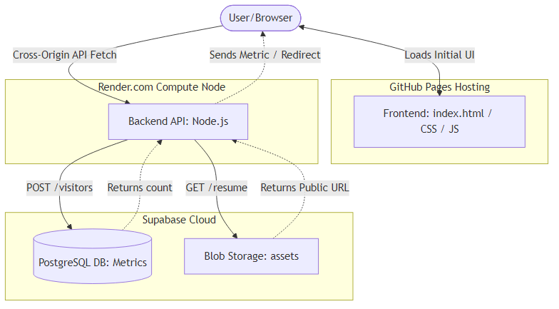

# Tushar Kumar Barman - High Performance Portfolio 🚀

A high-performance, dark-mode native portfolio built with raw HTML/CSS and a modern Node.js backend. This project incorporates interactive physics-based UI elements, real-time metrics tracking, and cloud-hosted assets seamlessly stitched together without heavy frontend frameworks.

---

## 🏗️ High-Level Design (HLD)

The architecture is explicitly designed to be ultra-lightweight on the client side while maintaining robust persistent tracking and file serving on the backend.



### 1. The Presentation Layer (Frontend)
Hosted statically on **GitHub Pages** for ultra-fast global distribution.
*   **Vanilla Excellence:** Zero heavy frontend frameworks (no React/Vue). This ensures perfect Lighthouse performance scores and instantaneous TTFB (Time to First Byte).
*   **Interactive Physics:** Implements physics-simulated keyframe CSS animations (e.g., The pull-string physics logic and the Rock Lee 8-Gates interactive sprite).
*   **Cross-Origin Fetching:** Directly queries the Render backend server via fully decoupled remote endpoints for live dynamic data.

### 2. The Compute Node (Backend)
Located in `server.js` and hosted as a Web Service on **Render**.
*   **Architecture:** A native minimal Node.js server.
*   **Decoupled State:** Validates API routes (`/api/visitors`, `/api/resume`) and safely mediates traffic to the Cloud Database behind completely open CORS barriers without exposing direct DB manipulation to the browser.

### 3. Database & Object Storage (Supabase)
*   **Metrics:** A highly scalable PostgreSQL table responsible solely for iterating cross-session unique visitor counts.
*   **Asset Bucket:** A dedicated edge-cached Object Storage bucket hosting static binaries (like the user's PDF Resume), allowing hot-swapping of the document without pushing direct Git commits to the deployment pipeline.

---

## 🛠️ Local Development

### Prerequisites
*   Node.js (v18+)
*   A Supabase Project (with a `metrics` table & public bucket)

### Setup
1. Clone the repository: `git clone https://github.com/callmetushar123/Portfolio.git`
2. Install dependencies: `npm install`
3. Create a `.env` file in the root directory:
   ```env
   SUPABASE_URL=your_project_url
   SUPABASE_KEY=your_anon_key
   ```
4. Start the server:
   ```bash
   npm start
   ```
5. Navigate to `http://localhost:3000`

---

## ☁️ Deployment Architecture

This project tightly follows decoupled hosting for best free tier scaling and performance:
1. **Frontend (GitHub Pages):** Simply enable GitHub Pages in your repository settings pointing to the `main` branch to host `index.html` on a clean, reputable `.github.io` URL.
2. **Backend (Render):** Deploy `server.js` via a **Blueprint Deployment** using the included `render.yaml`. Render automatically detects the configuration and prompts you securely for your Supabase `.env` variables!
